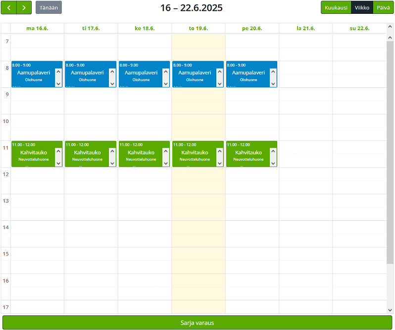

<h1 align="center"> HuoneKalenteri </h1>

---

<h3> Download </h3>
<a href="https://codeload.github.com/nesterinen/HuoneKalenteri/zip/refs/heads/main"> Download(.zip) </a>

Then login to your wordpress admin site, and go to the plugins page ~/wp-admin/plugins.php

<ol>
  <li></li>
  <li></li>
  <li></li>
  <li></li>
  <li></li>
</ol>

---

<h3> -Changing which rooms are available- </h3>

List of rooms and their respective display colors are hard coded into index.php as a global variable. &#129318;

To access and modify index.php in wordpress/wp-admin/plugin-editor.php

<ul>
  <li>
    <h3>DISABLE PLUGIN BEFORE EDITING FILES.</h3>
    
Go to plugin file editor

    
  </li>
  <li>
    
Select TilaKalenteri

    
  </li>
  <li>
    
Find "global $huone_available_rooms;" variable

    
  </li>
  <li>
    
Example: 'Kellari' => '#00E9ED' | 'nameOfRoom' => '#hexColor'

    
  </li>
  <li>
    
Click Update to save changes.

    
  </li>
  <li>
    <h3>ENABLE PLUGIN AGAIN HERE</h3>
    
Calendar now has a new option

    
  </li>
</ul>

---